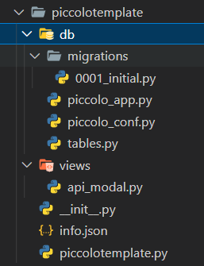

# red-postgres

Piccolo Postgres integration for Red-DiscordBot


# File structure for using with cogs
```
cog-folder/
    ├── db/
    │   ├── migrations/
    │   ├── piccolo_conf.py
    │   ├── piccolo_app.py
    │   ├── tables.py
    ├── __init__.py
    ├── cog.py
```


# piccolo_conf.py
```python
import os

from piccolo.conf.apps import AppRegistry
from piccolo.engine.postgres import PostgresEngine

DB = PostgresEngine(
    config={
        "database": os.environ.get("POSTGRES_DATABASE"),
        "user": os.environ.get("POSTGRES_USER"),
        "password": os.environ.get("POSTGRES_PASSWORD"),
        "host": os.environ.get("POSTGRES_HOST"),
        "port": os.environ.get("POSTGRES_PORT"),
    }
)


APP_REGISTRY = AppRegistry(apps=["db.piccolo_app"])
```

# piccolo_app.py
```python
import os

from piccolo.conf.apps import AppConfig, table_finder

CURRENT_DIRECTORY = os.path.dirname(os.path.abspath(__file__))

APP_CONFIG = AppConfig(
    app_name="cog_name",
    table_classes=table_finder(["db.tables"]),
    migrations_folder_path=os.path.join(CURRENT_DIRECTORY, "migrations"),
)
```
for `table_classes` add in the list of tables you're using